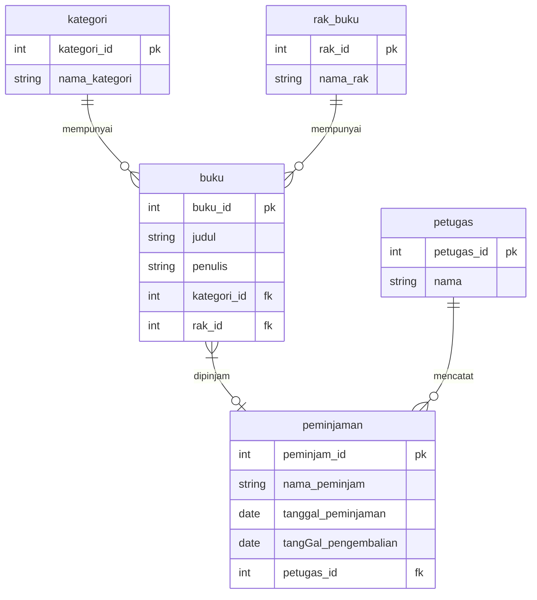

```mermaid
    erDiagram
    buku{
        int buku_id pk
        string judul
        string penulis
        int kategori_id fk
        int rak_id fk
    }

    kategori{
        int kategori_id pk
        string nama_kategori

    }
    rak_buku{
        int rak_id pk
        string nama_rak
        
    }
    petugas{
        int petugas_id pk
        string nama
    }
    peminjaman{
        int peminjam_id pk
        string nama_peminjam
        date tanggal_peminjaman
        date tangGal_pengembalian
        int petugas_id fk
    }

    kategori ||--o{ buku : mempunyai
    rak_buku ||--o{ buku : mempunyai
    buku }|--o| peminjaman : dipinjam
    petugas ||--o{ peminjaman : mencatat


```