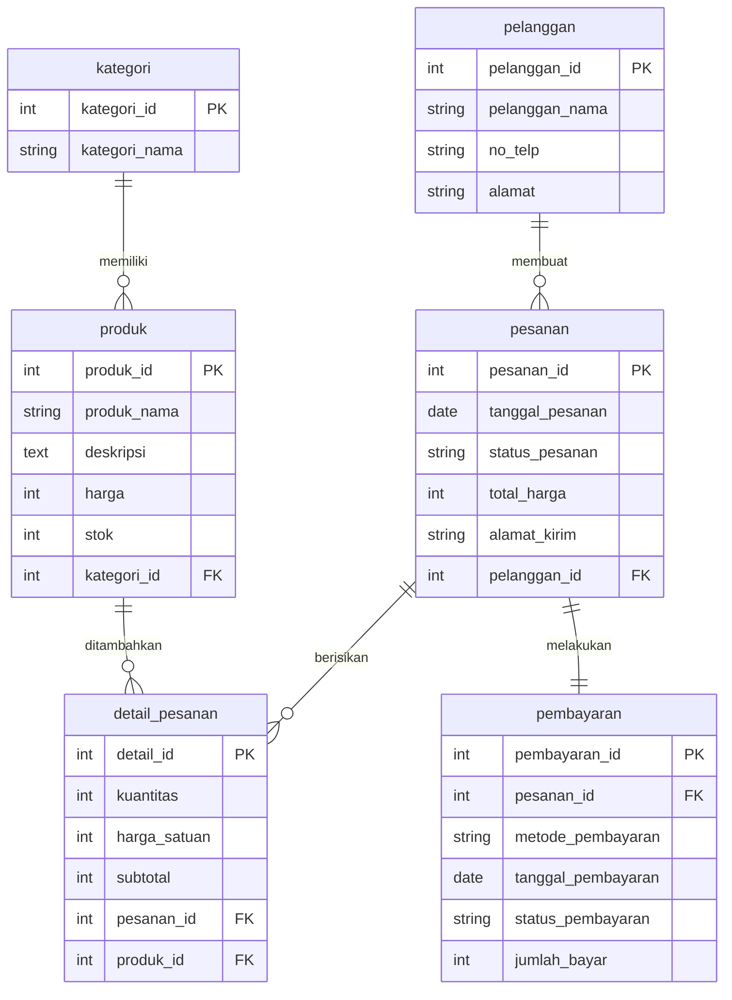

```mermaid
erDiagram
    kategori {
        int kategori_id PK
        string kategori_nama
    }
    
    produk {
        int produk_id PK
        string produk_nama
        text deskripsi
        int harga
        int stok
        int kategori_id FK
    }
    
    pelanggan {
        int pelanggan_id PK
        string pelanggan_nama
        string no_telp
        string alamat
    }
    
    pesanan {
        int pesanan_id PK
        date tanggal_pesanan
        string status_pesanan
        int total_harga
        string alamat_kirim
        int pelanggan_id FK
    }
    
    detail_pesanan {
        int detail_id PK
        int kuantitas
        int harga_satuan
        int subtotal
        int pesanan_id FK
        int produk_id FK
    }
    
    pembayaran {
        int pembayaran_id PK
        int pesanan_id FK
        string metode_pembayaran
        date tanggal_pembayaran
        string status_pembayaran
        int jumlah_bayar
    }

    kategori ||--o{ produk : memiliki
    pelanggan ||--o{ pesanan : membuat
    pesanan ||--o{ detail_pesanan : berisikan
    produk ||--o{ detail_pesanan : ditambahkan
    pesanan ||--|| pembayaran : melakukan

```